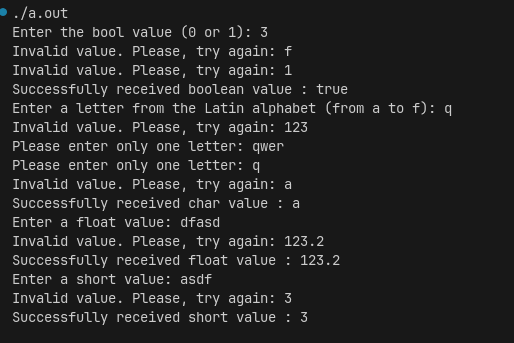

# Лабораторна робота №5

<p align="center"> 
Часу приділено лабораторній роботі: 
</p>

## Навчальний заклад

Відокремлений структурний підрозділ
**"Фаховий коледж інформаційних технологій**
**Національного університету “Львівська політехніка”**

**Виконав:** студент групи МТ-22
**Одарчук Олексій**

---

## Тема

**Обробка некоректного користувацького вводу.**

## Мета

Засвоїти основні принципи обробки некоректного користувацького вводу в мові програмування C++. Ознайомитися з методами виявлення помилок при введенні даних, навчитися використовувати засоби валідації, перевірки коректності вводу.

## Завдання

Розробити програму що вимагає від користувача введення типів даних та проводить обробку некоректного користувацького вводу згідно таблиці:

## Таблиця типів даних та їх обробки

| Тип даних | Суть обробки | Дані для перевірки: Значення | Дані для перевірки: Результат |
| :--- | :--- | :--- | :--- |
| **bool** | Дозволяє користувачу введення двох варіантів (0 або 1), що означає **false (0)** або **true (1)** відповідно. | 0 | успішно |
| | | 1 | успішно |
| | | 2 | помилка |
| | | -1 | помилка |
| | | !, \* | помилка |
| | | 1.5, 2.8 | помилка |
| | | \<empty\> | помилка |
| **char** | Дозволяє користувачу введення символів латинського алфавіту в діапазоні **a-f** (a, b, c, d, e, f) | d | успішно |
| | | a,b,c,d,e,f | успішно |
| | | g,k,j,s,m,y | помилка |
| | | 1,2,3,4... | помилка |
| | | \*, \$, \% | помилка |
| | | aa,bb,dd | помилка |
| | | \<empty\> | помилка |
| | | A,B,C,D,E | помилка |
| **float/double** | Дозволяє користувачу введення довільного **дробового числового значення** | 2.14, 3.22 | успішно |
| | | a,b,abc | помилка |
| | | A,B,ABC | помилка |
| | | \*, \$, \% | помилка |
| | | \<empty\> | помилка |
| **short** | Дозволяє користувачу введення довільного **цілого числового значення** в діапазоні **-32767 - +32767** | 25452, -14255 | успішно |
| | | -40255, 57205 | помилка |
| | | a,b,abc | помилка |
| | | A,B,ABC | помилка |
| | | \*, \$, \% | помилка |
| | | \<empty\> | помилка |

## Структура проєкту

root_dir/  
├── bin/ — Директорія для скомпільованих файлів програми  
├── build/ — Директорія з build файлами, що важливі для збірки CMake  
├── [build.bat](build.bat) — Скрипт збірки для Windows  
├── [build.sh](build.sh)  — Скрипт збірки для Linux/macOS  
├── [CMakeLists.txt](CMakeLists.txt) — Файл конфігурації збірки CMake  
├── images — Директорія з дображеннями  
│   └── [image.png](images/image.png) — Зображення для документації  
├── include — Директорія з заголовковими файлами (.hpp)  
│   └── [InputValidator.hpp](include/InputValidator.hpp) # Файл заголовка з класом InputValidator  
├── [Laba_5.cpp](Laba_5.cpp) — Простий варіант лабораторної роботи, що базується на лекціях і вимогах  
├── [Laba_5_onefile.cpp](Laba_5_onefile.cpp) - Основний варіант програми, але в однофайловому представленні  
├── [README.md](README.md) — Документація  
└── src — Файли реалізації основної програми (.cpp)  
    └── [main.cpp](src/main.cpp) —  Основна програма, виклик і тестування класу InpytValidator  

## Збірка та запуск

Проєкт використовує **CMake** для керування процесом збірки. Для зручності були створені скрипти `build.sh` (для Linux/macOS) та `build.bat` (для Windows).

### Інструкція для Linux/macOS

```bash
# Надати права на виконання скрипту
chmod +x build.sh
# Запустити скрипт
./build.sh
```

### Інструкція для Windows

```bash
# Запустити скрипт
./build.bat
```

### Запуск програм

Після збірки ви можете запустити виконуваний файл, перейшовши у відповідну директорію (`bin/`).

## Скріншот роботи програми



## Відповіді на контрольні запитання

1. **Що таке некоректний користувацький ввід і чому він може виникати?**  
   Некоректний ввід — це ситуація, коли користувач вводить дані, які не відповідають очікуваному формату або типу.  
   **Причини виникнення:**  
   - Введення букв замість чисел.  
   - Введення значень поза допустимим діапазоном.  
   - Порожній ввід або пропуски.  
   - Спеціальні символи або неправильний формат.

2. **Як можна перевірити, чи є введене користувачем значення числом?**  
   - Для `int` чи `float` у C++ можна використовувати перевірку з `std::cin`:  

    ```cpp
     int x;
     if (std::cin >> x) {
         // число введено коректно
     } else {
         // некоректний ввід
     }
     ```

3. **Як перевірити, чи введені дані знаходяться в межах певного числового діапазону?**  

   ```cpp
   int x;
   std::cin >> x;
   if (x >= min_value && x <= max_value) {
       // в межах діапазону
   } else {
       // поза діапазоном
   }

4. **Як обробити некоректний ввід рядкових даних, коли очікується число?**  

   - Очистити стан потоку після помилки:  

     ```cpp
     std::cin.clear();
     ```  

   - Пропустити некоректні символи у буфері:  

     ```cpp
     std::cin.ignore(std::numeric_limits<std::streamsize>::max(), '\n');
     ```  

   - Повторно запитати користувача про введення числа.

5. **Як можна реалізувати повторне запитування користувача для правильного вводу після помилки?**  
   - Використовувати цикл `while` або `do-while`:  

     ```cpp
     int x;
     while (true) {
         std::cout << "Введіть число: ";
         if (std::cin >> x) break; // ввід коректний
         std::cin.clear(); // очищення стану помилки
         std::cin.ignore(std::numeric_limits<std::streamsize>::max(), '\n'); // очищення буфера
         std::cout << "Некоректний ввід. Спробуйте ще раз.\n";
     }
     ```

6. **Що означає поняття "буфер вводу" і як ним керувати в C++?**  
   - **Буфер вводу** — тимчасове сховище символів, введених користувачем, які ще не були прочитані програмою.  
   - Керування буфером:  
     - `std::cin.ignore()` — пропуск символів у буфері.  
     - `std::cin.clear()` — скидання стану потоку після помилки.

7. **Які особливості перевірки коректності вводу для числових типів даних (`int`, `float`, `double`)?**  
   - Введення букв замість чисел викликає помилку вводу.  
   - Потрібно очищати стан потоку після помилки (`std::cin.clear()`).  
   - Перевірка діапазону значень обов’язкова.  
   - Для `float`/`double` враховувати формат числа (крапка чи кома).

8. **Як виявити і обробити введення користувачем букв замість чисел?**  
   - Перевіряти результат оператора `>>`:  

     ```cpp
     int number;
     if (!(std::cin >> number)) {
         std::cin.clear();
         std::cin.ignore(std::numeric_limits<std::streamsize>::max(), '\n');
         std::cout << "Введено некоректне число.\n";
     }
     ```

9. **Як можна обробити некоректний ввід даних для роботи з меню (наприклад, введення невірної команди)?**  
   - Використовувати цикл та `switch-case` для обробки допустимих варіантів:  

     ```cpp
     char choice;
     bool valid = false;
     
     while (!valid) {
         std::cout << "Виберіть пункт меню (1-3): ";
         std::cin >> choice;
         
         switch (choice) {
             case '1':
                 std::cout << "Ви обрали пункт 1\n";
                 valid = true;
                 break;
             case '2':
                 std::cout << "Ви обрали пункт 2\n";
                 valid = true;
                 break;
             case '3':
                 std::cout << "Ви обрали пункт 3\n";
                 valid = true;
                 break;
             default:
                 std::cout << "Некоректний вибір. Спробуйте ще раз.\n";
                 break;
         }
     } 
     ```

   - Цей підхід дозволяє чітко обробляти кожен пункт меню та повторно запитувати користувача у разі помилки.І

10. **Чому важливо правильно обробляти некоректний ввід в програмах і до яких наслідків може призвести його ігнорування?**
    - Забезпечує стабільну та передбачувану роботу програми.  
    - Запобігає аварійним завершенням, некоректним обчисленням або збоям.  
    - Ігнорування некоректного вводу може призвести до неправильних результатів або небезпечної поведінки програми.
